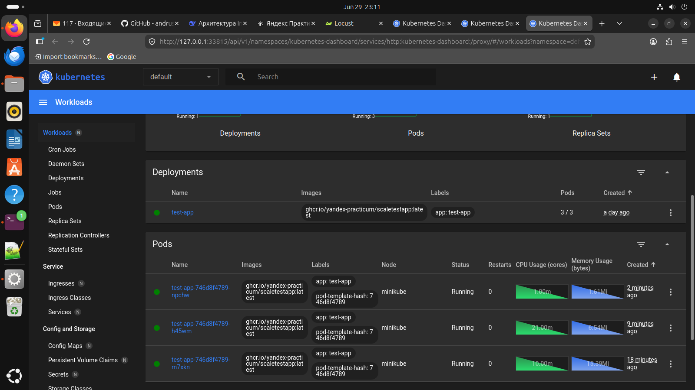

## Часть 1. Динамическая маршрутизация на основании показателей утилизации памяти

### Результаты работы 

---
## Запускаем forward в term 1
```bash
kubectl port-forward service/test-app-service 8080:8080
```


# Запускаем в term 2 locust (при необходимости устанавливаем)

```bash
# 1. Переходим в директорию Task2
cd ~/IdeaProjects/architecture-insuretech/Task2

# 2. Создаем виртуальное окружение
python3 -m venv venv

# 3. Активируем виртуальное окружение
source venv/bin/activate

# 4. Устанавливаем Locust
pip install locust

# 5. Проверяем установку
locust --version

# 6. Запускаем Locust
APP_URL=$(minikube service test-app-service --url)
locust -f locustfile.py --host=$APP_URL
```
### Наблюдаем в dashboard Kubernetes увеличение количества подов 



## term 3
### Смотрим, как HPA увеличивает количество подов (рост запросов посредством locust)

```
user@userVirtualPC:~/IdeaProjects/architecture-insuretech/Task2$ kubectl get hpa -w
NAME                  REFERENCE             TARGETS          MINPODS   MAXPODS   REPLICAS   AGE
test-app-hpa-memory   Deployment/test-app   memory: 7%/50%   1         10        1          34h
test-app-hpa-memory   Deployment/test-app   memory: 23%/50%   1         10        1          34h
test-app-hpa-memory   Deployment/test-app   memory: 61%/50%   1         10        1          34h
test-app-hpa-memory   Deployment/test-app   memory: 61%/50%   1         10        2          34h
test-app-hpa-memory   Deployment/test-app   memory: 36%/50%   1         10        2          34h
test-app-hpa-memory   Deployment/test-app   memory: 37%/50%   1         10        2          34h
test-app-hpa-memory   Deployment/test-app   memory: 42%/50%   1         10        2          34h
test-app-hpa-memory   Deployment/test-app   memory: 47%/50%   1         10        2          34h
test-app-hpa-memory   Deployment/test-app   memory: 52%/50%   1         10        2          34h
test-app-hpa-memory   Deployment/test-app   memory: 54%/50%   1         10        2          34h
test-app-hpa-memory   Deployment/test-app   memory: 56%/50%   1         10        2          34h
test-app-hpa-memory   Deployment/test-app   memory: 56%/50%   1         10        3          34h
test-app-hpa-memory   Deployment/test-app   memory: 39%/50%   1         10        3          34h
test-app-hpa-memory   Deployment/test-app   memory: 39%/50%   1         10        3          34h
test-app-hpa-memory   Deployment/test-app   memory: 39%/50%   1         10        3          34h
test-app-hpa-memory   Deployment/test-app   memory: 40%/50%   1         10        3          34h
test-app-hpa-memory   Deployment/test-app   memory: 40%/50%   1         10        3          34h
test-app-hpa-memory   Deployment/test-app   memory: 40%/50%   1         10        3          34h
test-app-hpa-memory   Deployment/test-app   memory: 40%/50%   1         10        3          34h
test-app-hpa-memory   Deployment/test-app   memory: 40%/50%   1         10        3          34h
```

