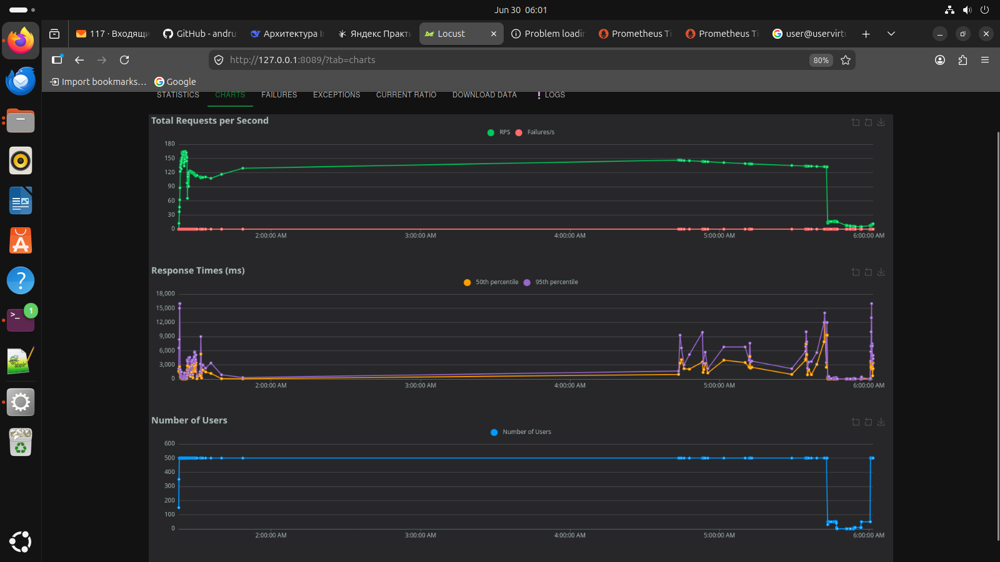

## Часть 2. Динамическая маршрутизация на основании метрики RPS

## Переходим в директорию Task2
```bash
cd ~/IdeaProjects/architecture-insuretech/Task2
```
###  term 1 (port-forward )
```
kubectl port-forward -n monitoring svc/prometheus-kube-prometheus-prometheus 9090:9090
```
### term 2 (Locust)
```
# Получаем URL
APP_URL=$(minikube service test-app-service --url)
echo $APP_URL

# Запускаем Locust
cd ~/IdeaProjects/architecture-insuretech/Task2
source venv/bin/activate
APP_URL=$(minikube service test-app-service --url)
locust -f locustfile.py --host=$APP_URL
```

## Результаты работы 

### Генерация нагрузки locust (метрика rps)


## Метрика RPS по подпм в prometheus 


## Смотрим, как HPA уменьшает количество подов

```
user@userVirtualPC:~/IdeaProjects/architecture-insuretech/Task2$ 
kubectl get hpa -w


NAME               REFERENCE             TARGETS    MINPODS   MAXPODS   REPLICAS   AGE
test-app-hpa-rps   Deployment/test-app   2285m/10   1         10        10         63m
test-app-hpa-rps   Deployment/test-app   2023m/10   1         10        10         63m
test-app-hpa-rps   Deployment/test-app   1719m/10   1         10        10         63m
test-app-hpa-rps   Deployment/test-app   1635m/10   1         10        10         63m
test-app-hpa-rps   Deployment/test-app   1648m/10   1         10        10         64m
test-app-hpa-rps   Deployment/test-app   1639m/10   1         10        10         64m
test-app-hpa-rps   Deployment/test-app   1629m/10   1         10        10         64m
test-app-hpa-rps   Deployment/test-app   1626m/10   1         10        10         64m
test-app-hpa-rps   Deployment/test-app   1646m/10   1         10        10         65m
test-app-hpa-rps   Deployment/test-app   1592m/10   1         10        9          65m
test-app-hpa-rps   Deployment/test-app   1559m/10   1         10        8          65m
test-app-hpa-rps   Deployment/test-app   1336m/10   1         10        8          65m
test-app-hpa-rps   Deployment/test-app   1037m/10   1         10        7          66m
test-app-hpa-rps   Deployment/test-app   824m/10    1         10        7          66m
test-app-hpa-rps   Deployment/test-app   580m/10    1         10        6          66m
test-app-hpa-rps   Deployment/test-app   338m/10    1         10        5          66m
test-app-hpa-rps   Deployment/test-app   159m/10    1         10        5          67m
test-app-hpa-rps   Deployment/test-app   7m/10      1         10        4          67m
test-app-hpa-rps   Deployment/test-app   19m/10     1         10        4          67m
test-app-hpa-rps   Deployment/test-app   30m/10     1         10        4          67m
test-app-hpa-rps   Deployment/test-app   57m/10     1         10        3          68m
test-app-hpa-rps   Deployment/test-app   79m/10     1         10        3          68m
test-app-hpa-rps   Deployment/test-app   0/10       1         10        2          68m
test-app-hpa-rps   Deployment/test-app   22m/10     1         10        2          68m
test-app-hpa-rps   Deployment/test-app   66m/10     1         10        2          69m
test-app-hpa-rps   Deployment/test-app   90m/10     1         10        2          69m
test-app-hpa-rps   Deployment/test-app   109m/10    1         10        2          69m
test-app-hpa-rps   Deployment/test-app   142m/10    1         10        2          69m
test-app-hpa-rps   Deployment/test-app   161m/10    1         10        2          70m
test-app-hpa-rps   Deployment/test-app   171m/10    1         10        2          70m
test-app-hpa-rps   Deployment/test-app   176m/10    1         10        2          70m
test-app-hpa-rps   Deployment/test-app   176m/10    1         10        2          70m
```

## Смотрим, как HPA увеличивает количество подов (рост запросов посредством locust)

```
Cuser@userVirtualPC:~/IdeaProjects/architecture-insuretech/Task2$ kubectl get hpa -w
NAME               REFERENCE             TARGETS   MINPODS   MAXPODS   REPLICAS   AGE
test-app-hpa-rps   Deployment/test-app   380m/10   1         10        1          71m
test-app-hpa-rps   Deployment/test-app   352m/10   1         10        1          71m
test-app-hpa-rps   Deployment/test-app   380m/10   1         10        1          71m
test-app-hpa-rps   Deployment/test-app   361m/10   1         10        1          72m
test-app-hpa-rps   Deployment/test-app   561m/10   1         10        1          72m
test-app-hpa-rps   Deployment/test-app   1/10      1         10        1          72m
test-app-hpa-rps   Deployment/test-app   1418m/10   1         10        1          72m
test-app-hpa-rps   Deployment/test-app   1847m/10   1         10        1          73m
test-app-hpa-rps   Deployment/test-app   2295m/10   1         10        1          73m
test-app-hpa-rps   Deployment/test-app   2695m/10   1         10        1          73m
test-app-hpa-rps   Deployment/test-app   3085m/10   1         10        1          73m
test-app-hpa-rps   Deployment/test-app   3257m/10   1         10        1          74m
test-app-hpa-rps   Deployment/test-app   3266m/10   1         10        1          74m
test-app-hpa-rps   Deployment/test-app   3257m/10   1         10        1          74m
test-app-hpa-rps   Deployment/test-app   3218m/10   1         10        1          75m
test-app-hpa-rps   Deployment/test-app   4085m/10   1         10        1          75m
test-app-hpa-rps   Deployment/test-app   5933m/10   1         10        1          75m
test-app-hpa-rps   Deployment/test-app   7914m/10   1         10        1          76m
test-app-hpa-rps   Deployment/test-app   9819m/10   1         10        1          76m
test-app-hpa-rps   Deployment/test-app   11590m/10   1         10        1          76m
test-app-hpa-rps   Deployment/test-app   13523m/10   1         10        2          76m
test-app-hpa-rps   Deployment/test-app   15467m/10   1         10        2          77m
test-app-hpa-rps   Deployment/test-app   8228m/10    1         10        2          77m
test-app-hpa-rps   Deployment/test-app   8238m/10    1         10        2          77m
test-app-hpa-rps   Deployment/test-app   8271m/10    1         10        2          77m
test-app-hpa-rps   Deployment/test-app   8238m/10    1         10        2          78m
test-app-hpa-rps   Deployment/test-app   8261m/10    1         10        2          78m
test-app-hpa-rps   Deployment/test-app   8195m/10    1         10        2          78m
test-app-hpa-rps   Deployment/test-app   8233m/10    1         10        2          78m
test-app-hpa-rps   Deployment/test-app   8176m/10    1         10        2          79m
test-app-hpa-rps   Deployment/test-app   9897m/10    1         10        2          79m
test-app-hpa-rps   Deployment/test-app   13795m/10   1         10        2          79m
test-app-hpa-rps   Deployment/test-app   16608m/10   1         10        3          79m
test-app-hpa-rps   Deployment/test-app   21744m/10   1         10        4          80m
test-app-hpa-rps   Deployment/test-app   26184m/10   1         10        4          80m
test-app-hpa-rps   Deployment/test-app   14449m/10   1         10        6          80m
test-app-hpa-rps   Deployment/test-app   16980m/10   1         10        6          80m
test-app-hpa-rps   Deployment/test-app   19237m/10   1         10        7          81m
test-app-hpa-rps   Deployment/test-app   13347m/10   1         10        7          81m
test-app-hpa-rps   Deployment/test-app   12153m/10   1         10        9          81m
test-app-hpa-rps   Deployment/test-app   11897m/10   1         10        9          81m
test-app-hpa-rps   Deployment/test-app   10913m/10   1         10        9          82m

```
### Список подов

```

user@userVirtualPC:~/IdeaProjects/architecture-insuretech/Task2$ kubectl get pods -l app=test-app
NAME                        READY   STATUS        RESTARTS   AGE
test-app-746d8f4789-472vf   1/1     Running       0          5h1m
test-app-746d8f4789-67zq7   1/1     Running       0          15m
test-app-746d8f4789-6p92l   1/1     Terminating   0          8m33s
test-app-746d8f4789-6plkb   1/1     Running       0          5h1m
test-app-746d8f4789-7898t   1/1     Running       0          5h1m
test-app-746d8f4789-bq76b   1/1     Running       0          5h1m
test-app-746d8f4789-f8r2q   1/1     Running       0          17m
test-app-746d8f4789-rt9kl   1/1     Running       0          5h1m
test-app-746d8f4789-wzn7k   1/1     Running       0          17m
test-app-746d8f4789-zwnjk   1/1     Running       0          17m
```


